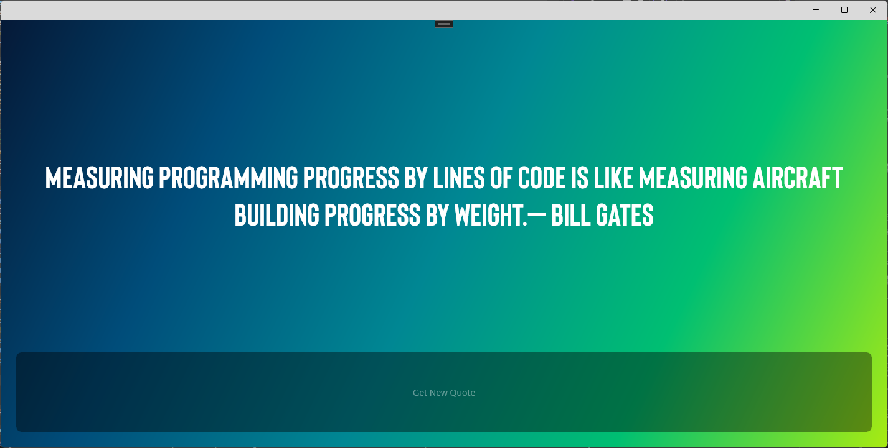
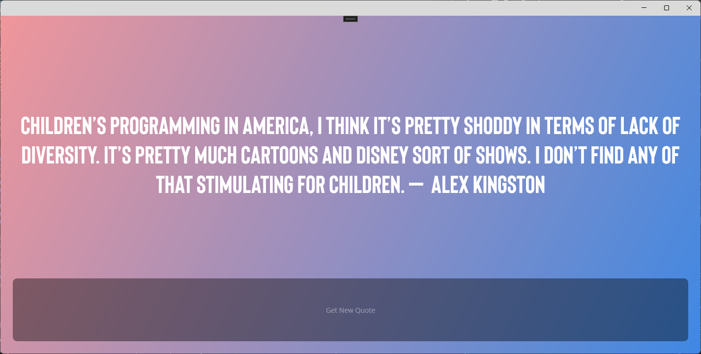
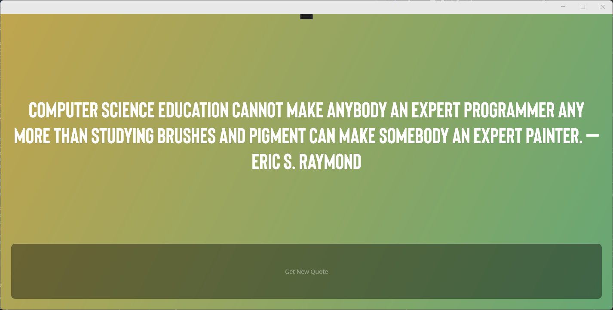

# Maui Practice - Maui Quotes For Programmers

- **One of my personal digital nomad life projects (for practice).**
- This is a sample app that was created to practice .NET MAUI.
- This application shows famous quotes about software development and other areas similar to that.
- **Project current status: [complete]**:ballot_box_with_check:
- **Tech**

  

    &emsp;
    
  

  

    &emsp;
    
  

- **Preview Screenshots**

  

    &emsp;
    
  

  &emsp;
  

    &emsp;
    
  

  &emsp;
  

    &emsp;
    
  

 
